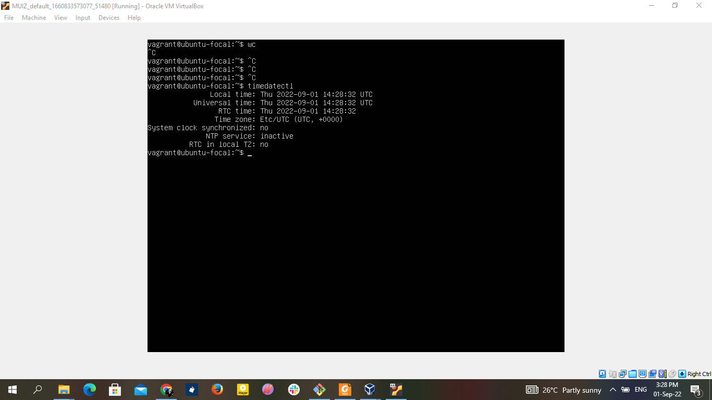
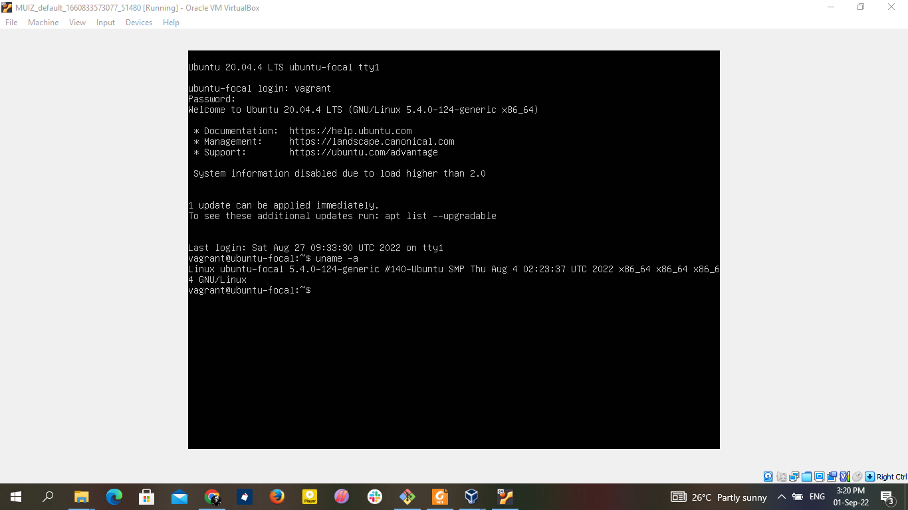
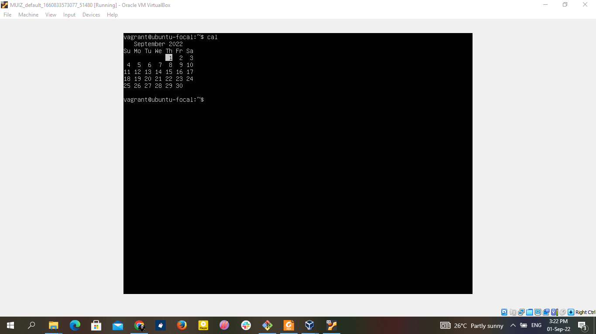
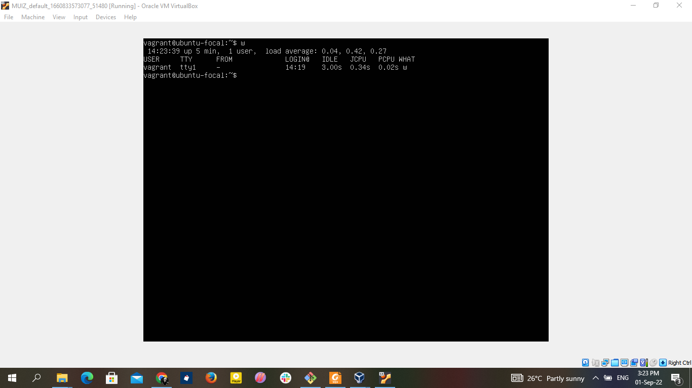
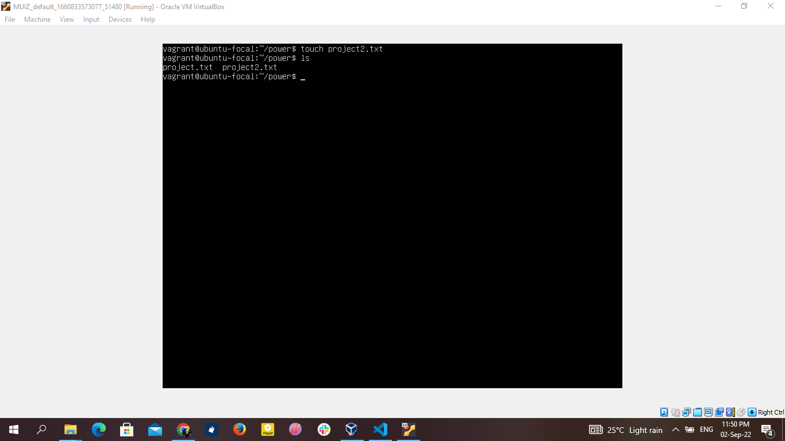
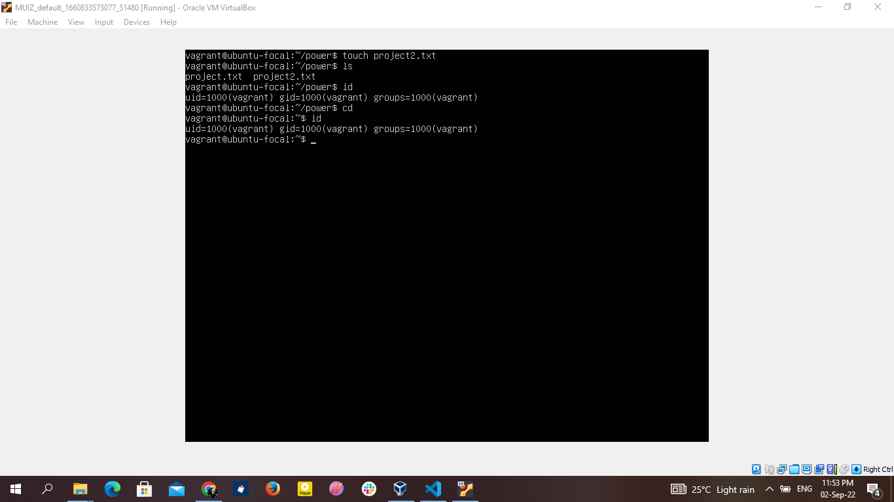

# other linux commands
* timedatectl = used to query and change the system clock.
   
* uname -a = displays system and kernel information,
    
* cal = displays the current callender month and day
   
* w = displays currently logged in user in the system
   
* last reboot = shows system reboot history
   
* df - i = displays free inodes on filesystem
   
* more filename= output the content of a file
   
* touch filename = used to create a new file
  
* id = displays the details of active user including the user id and group id
  
* ls -al = list files and directories with detailed information like the permission,size and owner.
  
  