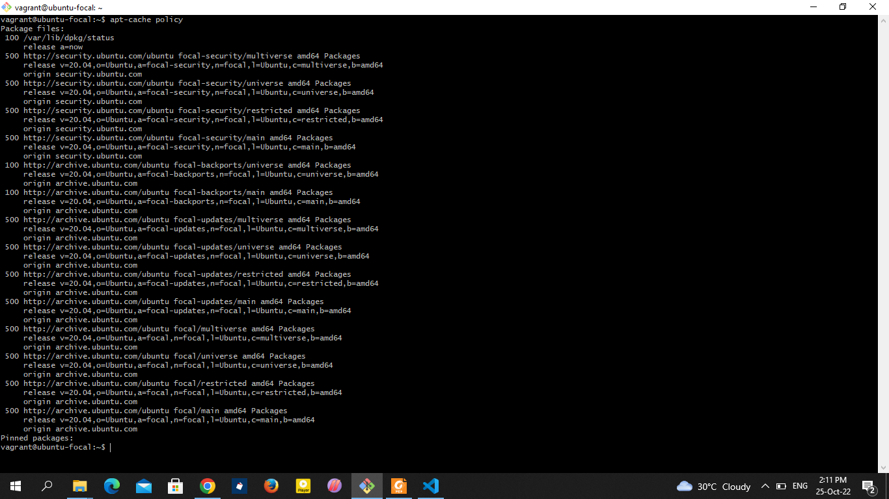
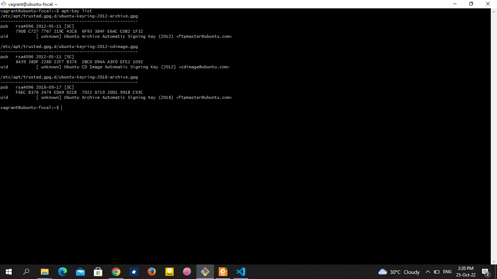
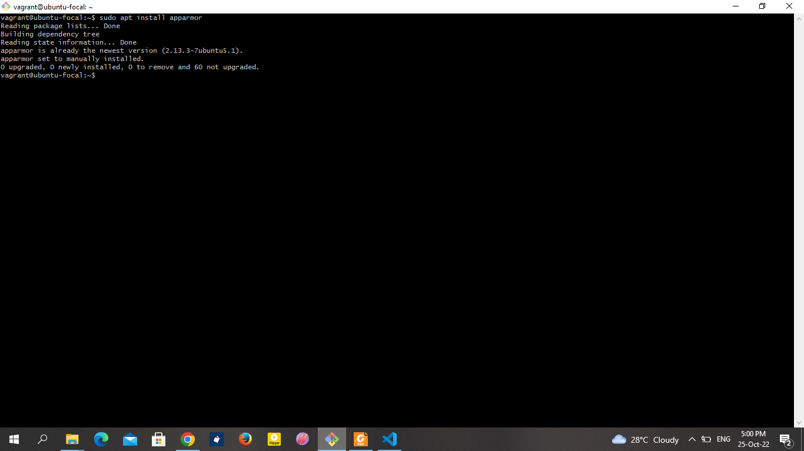
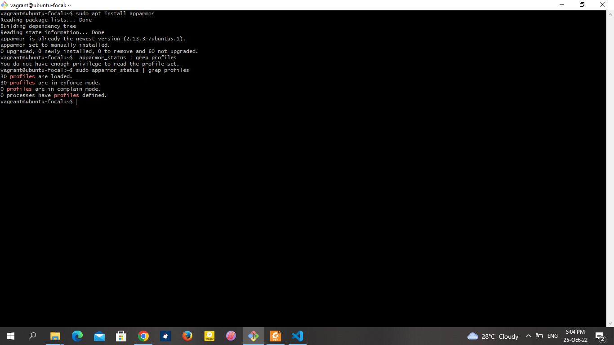
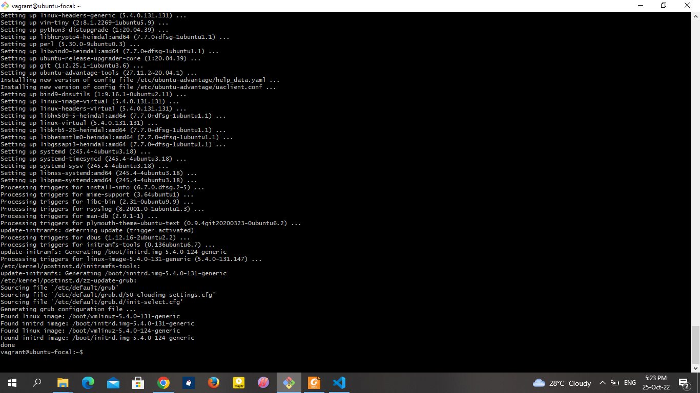
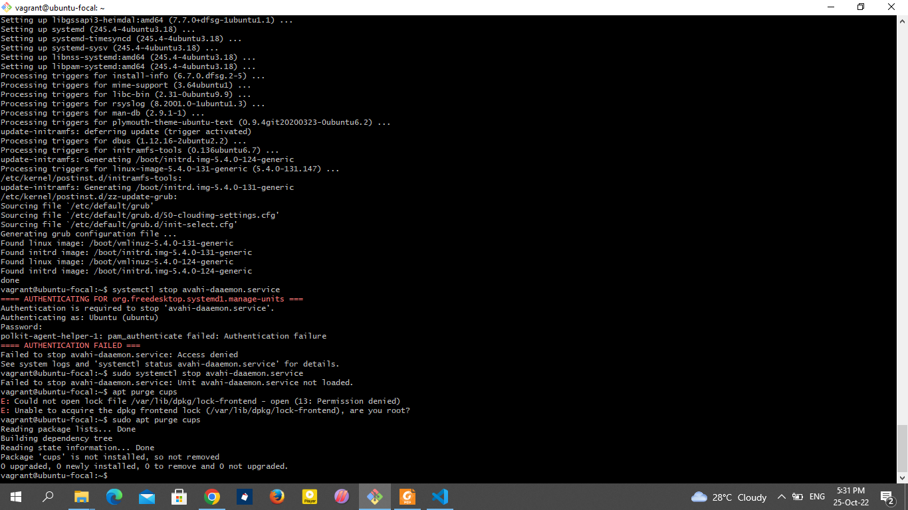

* Ensure package manager repositories are configured
   

* Ensure GPG keys are configured (Manual)
   

* Ensure AppArmor is installed (Automated)
    

* Ensure all AppArmor Profiles are in enforce or complain
mode (Automated)
    

* Ensure permissions on /etc/issue are configured

* Ensure updates, patches, and additional security software are
installed (Manual)
   

* Ensure LDAP server is not installed (Automated)

* Ensure NFS is not installed (Automated)
    {command: apt purge nfs-kernel-server}

*  Ensure CUPS is not installed (Automated)
     

