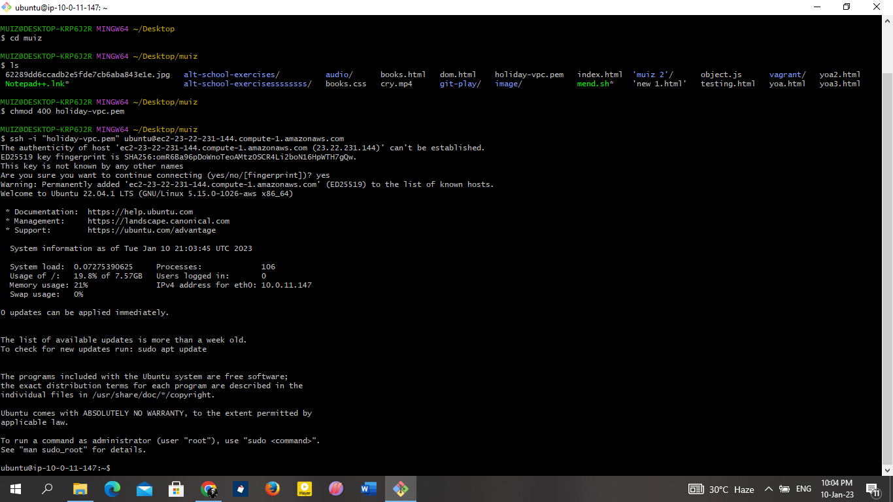
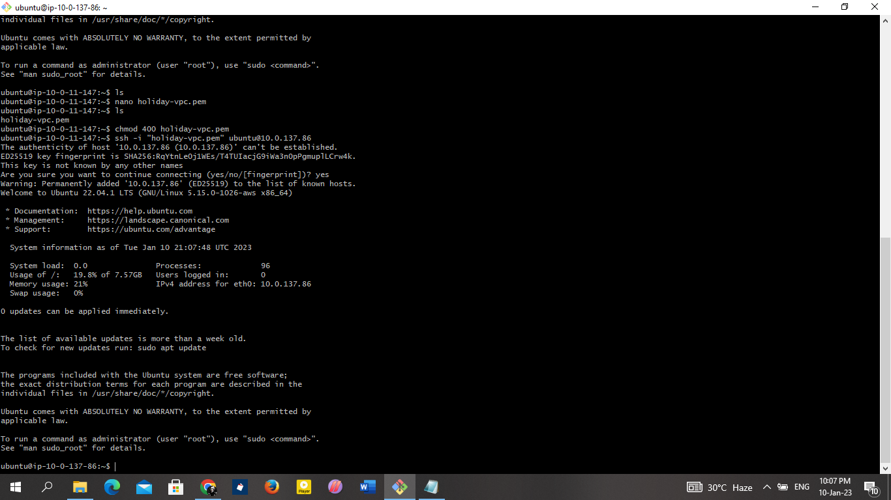
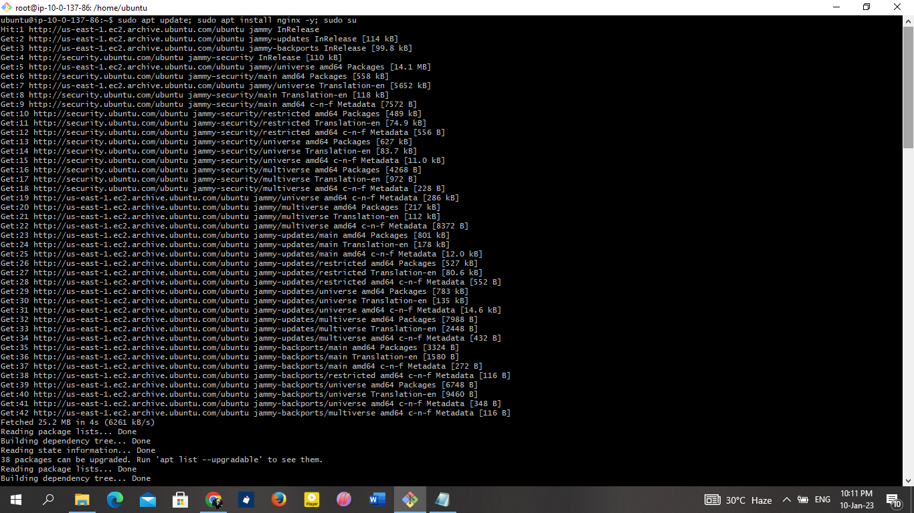
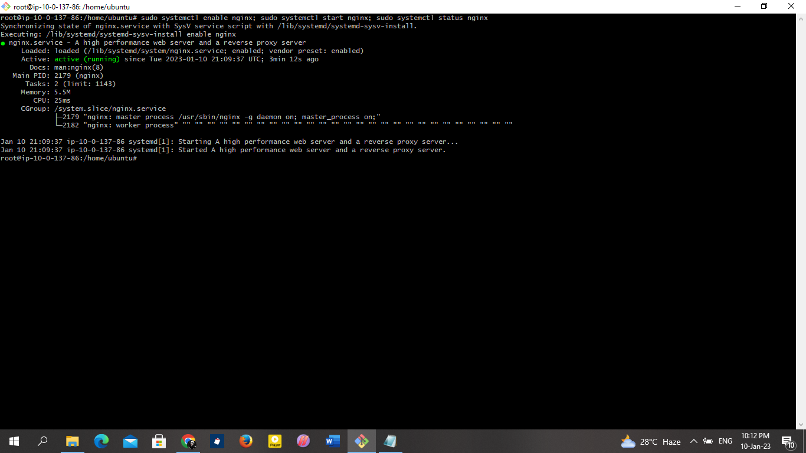

### nginx was installed on the two servers manually after accessing them through the bastion host

* logging into the basstion host

* logging into the private servers

* installing nginx

* confirming nginx status

